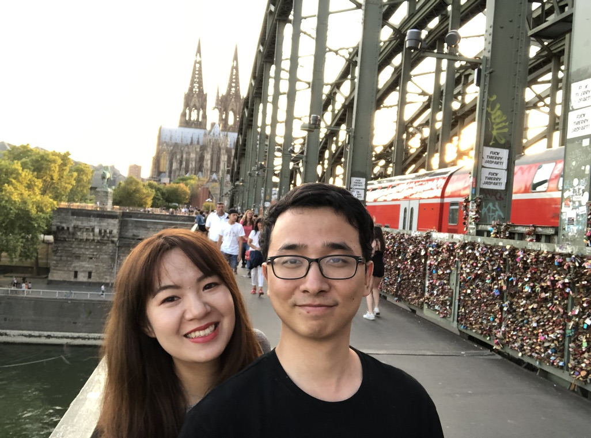

<!-- 简介 -->
Hi, I am Sichen Li, an experienced Data Scientist with a Ph.D. in Physics. 

<!-- 工作 -->
I have five years of experience in scientific data analysis. Throughout my Ph.D., I worked in the AMS-02 experiment, a cosmic ray detector located on the International Space Station (ISS), led by MIT Nobel physics laureate Prof. Ting and supported by NASA (visit [https://ams02.space](https://ams02.space) ). The international science group comprised over 500 scientists worldwide. As a data scientist in the AMS-02 physics data analysis team, I developed a comprehensive analysis methodology for cosmic antiproton components. This involved 150 steps, including raw data calibration, cleaning, reduction, training classifiers using Machine Learning methods, and employing advanced statistical models like Likelihood Template Fit to extract signals and backgrounds. My work contributed to constraining Dark Matter models by comparing analyzed components with theoretical expectations. Additionally, my results mark the first observation of cosmic antimatter behavior affected by solar activity.

<!--物理到工业界 -->
My passion for physics began in high school and has inspired me to dedicate over ten years to the field, progressing from a high school student to a Ph.D. holder. During my doctoral studies, I delved into physics data analysis and was captivated by the beauty of data science. Consequently, after completing my doctorate, I made the decision to transition to data science and contribute to the industry.

<!-- 性格 -->
I am an advocate of active learning and enjoy exploring new technological developments. My proactive nature and ability to thrive in high-pressure situations have been tested and refined through various academic and extracurricular activities, showcasing my suitability for fast-paced trading environments.

Within a team, I often assume the role of the office jester, leveraging my strong sense of humor to foster positive relationships with colleagues.

<!-- 兴趣 -->
Beyond my professional life, I find joy in hiking and have been an avid Table Tennis player since elementary school. In my leisure time, I indulge in browsing Wikipedia, appreciating its open and collaborative nature.

<!-- 语言 -->
As a native Chinese speaker, I am proficient in English at a professional level and have a basic understanding of German. Currently residing in Delft, Netherlands, I plan to learn Dutch. My girlfriend also works in the Netherlands, and we have a cat named Wolli.

<!-- 联系 -->
Contact me: sli@physik.rwth-aachen.de

LinkedIn: [https://www.linkedin.com/in/sichen-li-549ab59b/](https://www.linkedin.com/in/sichen-li-549ab59b/) 

